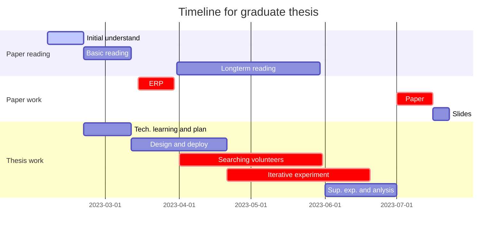

# GraduteThesis_Master
Master Graduate Thesis Materials

## Plan

## Scheduled meeting
Every Thursday or Friday.

## Paper work
Please refer to [the sharelatex site](https://sharelatex.tum.de/project/63a8a5565ac510008631f18f) of TU Munich.