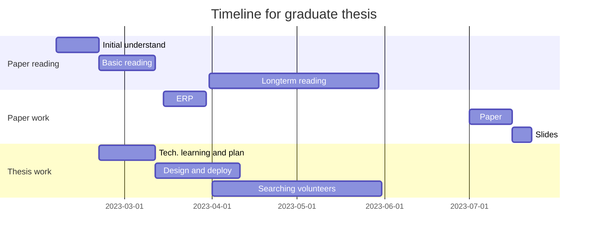

# GraduteThesis_Master
Master Graduate Thesis Materials

## Plan
Testers: April  
Design: March - April  
Exp: May  
Paper writing: July - August  

```mermaid
gantt
    title Timeline for graduate thesis
    dateFormat  YYYY-MM-DD
    section Paper reading
    Initial understand              :a1, 2023-02-05, 15d
    Basic reading                   :a2, after a1, 20d
    Longterm reading                :2023-03-31, 60d
    section Paper work
    ERP                             :b1, 2023-03-15, 15d
    Paper                           :b2, 2023-07-01, 15d
    Slides                          :b3, after b2, 7d
    section Thesis work
    Tech. learning and plan         :c1, after a1, 20d
    Design and deploy               :c2, after c1, 30d
    Searching volunteers            :c3, 2023-04-01, 60d
```
## Scheduled meeting
Every Thursday or Friday